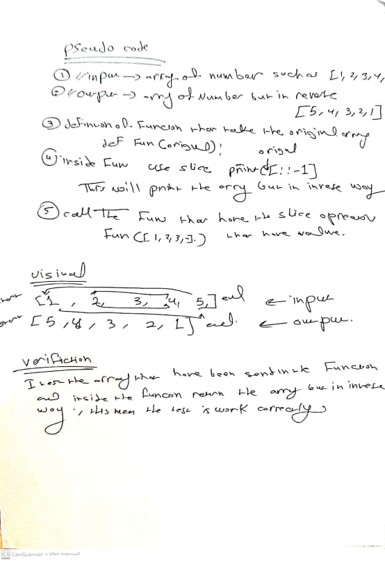

# Reverse an Array
 ## called reverseArray which takes an array as an argument. Without utilizing any of the built-in methods available to your language, return an array with elements in reversed order.

## Whiteboard Process

## Approach & Efficiency
 ### I  use the slice that make inverse to the array.
