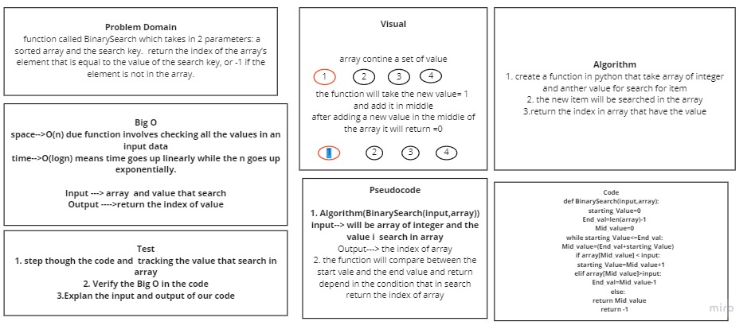

# Binary Search of Sorted Array
function called BinarySearch which takes in 2 parameters: a sorted array and the search key. return the index of the array’s element that is equal to the value of the search key, or -1 if the element is not in the array.

## Whiteboard Process

## Approach & Efficiency
<!-- What approach did you take? Discuss Why. What is the Big O space/time for this approach? -->
## space-->O(n) due function involves checking all the values in an input data
## time-->O(logn) means time goes up linearly while the n goes up exponentially.

