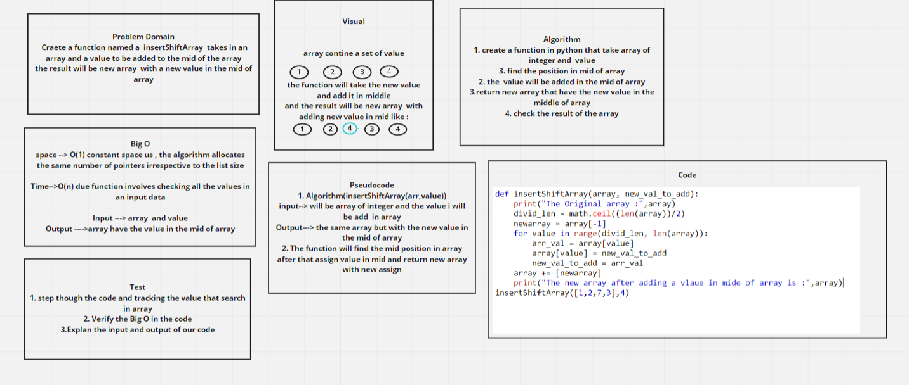

# Insert to Middle of an Array
Write a function called insertShiftArray which takes in an array and a value to be added. Without utilizing any of the built-in methods available to your language, return an array with the new value added at the middle index.

## Whiteboard Process

## Approach & Efficiency
<!-- What approach did you take? Discuss Why. What is the Big O space/time for this approach? -->
## the approach that I take is about thinking about the function that I faced and how to solve it

## I take 3 hrs to make this code.

## the Big O space  it was O(1)  due O(1)  constant space us , the algorithm allocates the same number of pointers irrespective to the list size
## the Big O time it was O(n)  due function involves checking all the values in an input data

