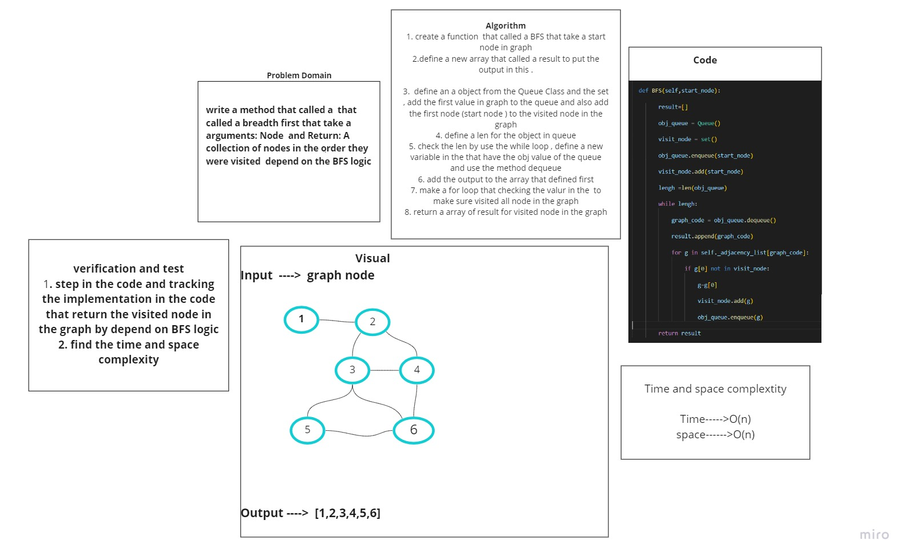

# Challenge Summary
<!-- Description of the challenge -->
## Write the following method for the Graph class:  create a method that called a breadth first that take a Arguments: Node and Return: A collection of nodes in the order they were visited .
## Whiteboard Process
<!-- Embedded whiteboard image -->

## Approach & Efficiency
<!-- What approach did you take? Why? What is the Big O space/time for this approach? -->
## O(n)
## O(n)
## Solution
<!-- Show how to run your code, and examples of it in action -->
## I test the BFS and it work correctly
