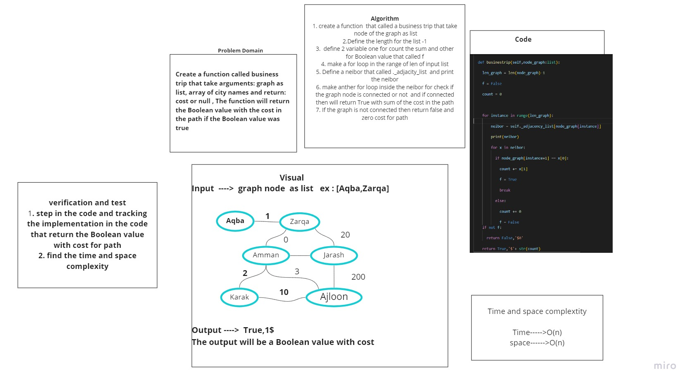

# Challenge Summary
<!-- Description of the challenge -->
## Write a function called business trip that take arguments: graph, array of city names and return: cost or null.

## Whiteboard Process
<!-- Embedded whiteboard image -->

## Approach & Efficiency
<!-- What approach did you take? Why? What is the Big O space/time for this approach? -->
## Time ----> O(n)
## Space ----> O(n)

## Solution
<!-- Show how to run your code, and examples of it in action -->
## I test the business trip  methods  and it work correctly
