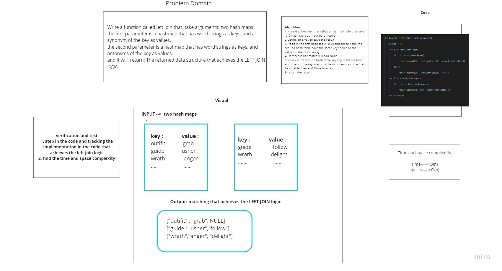

# Hashmap LEFT JOIN
<!-- Short summary or background information -->
## Write a function that LEFT JOINs two hashmaps into a single data structure.
### Write a function called left join
1. Arguments: two hash maps :
- The first parameter is a hashmap that has word strings as keys, and a synonym of the key as values.
- The second parameter is a hashmap that has word strings as keys, and antonyms of the key as values.
2. Return: The returned data structure that holds the results  of the LEFT JOINs.

## Challenge
<!-- Description of the challenge -->
## function that take a 2 hash table and return the matching value in key in both of hash table depend on the left join logic

## Approach & Efficiency
<!-- What approach did you take? Why? What is the Big O space/time for this approach? -->
## Time and Space complexity is O(n)
## Solution
<!-- Embedded whiteboard image -->
## I am tracing the code and it work correctly

## It takes 4 hrs to finish

