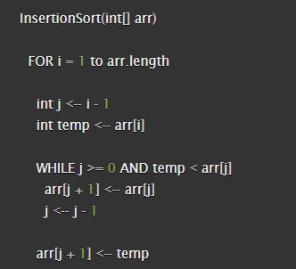
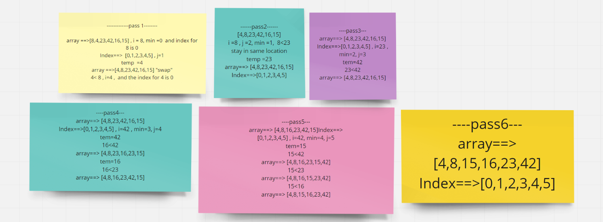
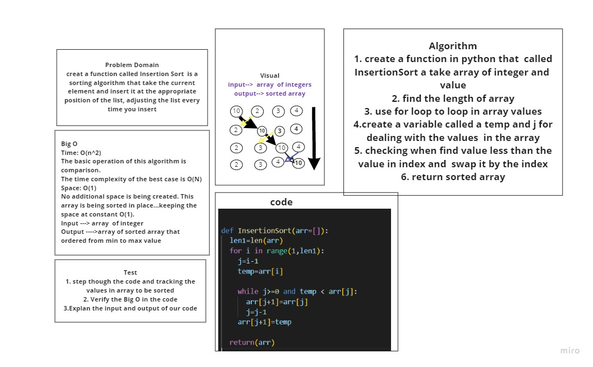

# insertion Sort --- Challenge Summary
## insertion Sort is a sorting algorithm that traverses the array multiple times as it slowly builds out the sorting sequence. The traversal keeps track of the minimum value and places it in the front of the array.

# Pseudocode

# Trace
## Sample Array: [8,4,23,42,16,15]

### Pass 1:
In the first pass through of the Insertion Sort  is  evaluate  currently present in index 0. and comparing with number in  index 1. The minimum value gets updated to remember this index.
### Pass 2:
The second pass through the array evaluates the remaining values in the array to see if there is a smaller value other than the current position of i. 8 is the 2nd smallest number in the array, so it “swaps” with itself.

### Pass 3:
The third pass through evaluates the remaining indexes in the array, the 23 and 42 values are ordred as smaller .

### Pass 4:
The 4th pass through on the array proves that 16 is the next smallest number in the array, and as a result, switches places with the 42, and then switches places with the 23.

### Pass 5:
The 5th pass through of the array only has one other index to evaluate. Since the last index value is smaller than 42, the two values will swap, and also this will happen for 16 and 23 they swaps with 15.

### Pass 6:
On its final iteratation through the array, it will swap places with itself as it evaluates the value against itself.

# Whiteboard Process

# Efficency
## Time: O(n^2)
- [x] The basic operation of this algorithm is comparison.
This will happen n * (n-1) number of times…concluding the algorithm to be n squared.
## Space: O(1)
- [x] No additional space is being created. This array is being sorted in place…keeping the space at constant O(1).
