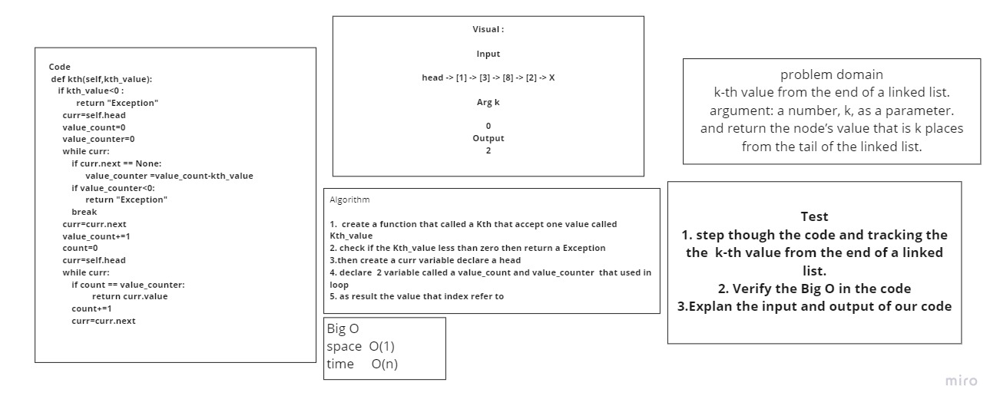

# Singly Linked List
<!-- Short summary or background information -->
## I create 2 method the first method was includes Arguments: value, Returns: Boolean
### Indicates whether that value exists as a Node’s value somewhere within the list.
### Arguments: none
### Returns: a string representing all the values in the Linked List, formatted as:
### "{ a } -> { b } -> { c } -> NULL"

# linked-list-kth

## kth from end
## argument: a number, k, as a parameter.
## Return the node’s value that is k places from the tail of the linked list.

## Whiteboard Process

## Approach & Efficiency
### Time  O(n)
### space O(1)

