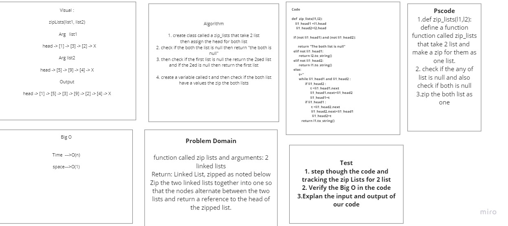

# Challenge Summary
<!-- Description of the challenge -->
1. Write a function called zip lists
2. Arguments: 2 linked lists
3. Return: Linked List, zipped : Zip the two linked lists together into one so that the nodes alternate between the two lists and return a reference to the head of the zipped list.
4. Try and keep additional space down to O(1)
5. You have access to the Node class and all the properties on the Linked List class as well as the methods created in previous challenges.
## Whiteboard Process
<!-- Embedded whiteboard image -->

## Approach & Efficiency
<!-- What approach did you take? Why? What is the Big O space/time for this approach? -->
## time O(n)
## space O(1)
## Solution
<!-- Show how to run your code, and examples of it in action -->

## the solution was zip for 2 list as one :  Zip the two linked lists together into one so that the nodes alternate between the two lists and return a reference to the head of the zipped list.
the pull requst : 
https://github.com/shahd1995913/data-structures-and-algorithms/pull/75
https://github.com/shahd1995913/data-structures-and-algorithms/pull/76/
https://github.com/shahd1995913/data-structures-and-algorithms/pull/77

