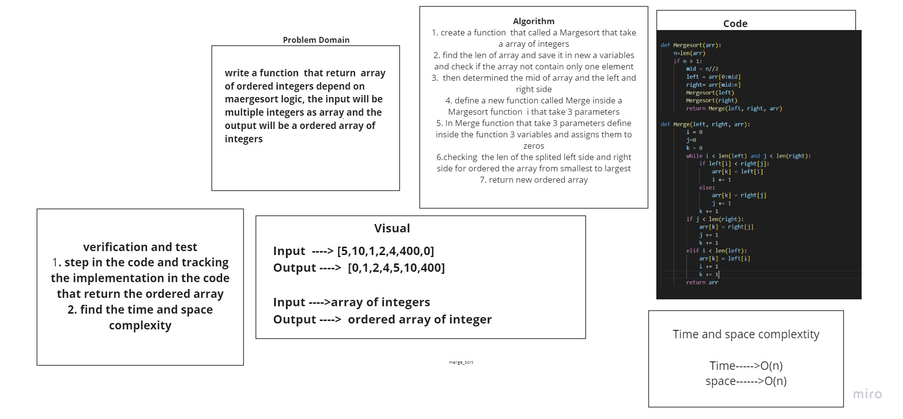

# Challenge Summary
<!-- Description of the challenge -->
## write a function that take array of integer as input and return a nre ordered array depend on 2 function the 1st one called a  Mergesort(arr)  that take array of integer and called a anthor function that called a Merge(left, right, arr) that take the left and right and array for make marge for array in orderd way .
## Whiteboard Process
<!-- Embedded whiteboard image -->

## Approach & Efficiency
<!-- What approach did you take? Why? What is the Big O space/time for this approach? -->
## Time and space complextity :
## Time -->O(n)
## Spac -->O(n)
## Solution
<!-- Show how to run your code, and examples of it in action -->
## I make test for function and it work corretly

## Link to the blog page  [BLOG](https://shahd1995913.github.io/data-structures-and-algorithms/python/code_challenges/merge_sort/BLOG)

