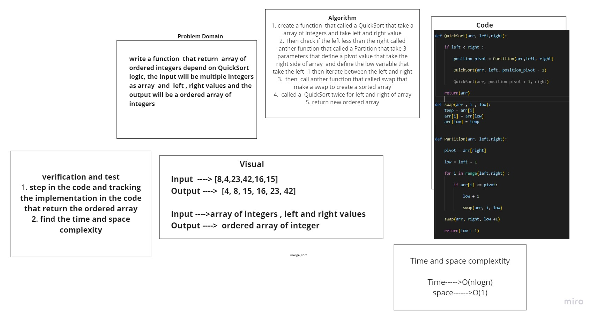

# Challenge Summary
<!-- Description of the challenge -->
## write a function that called QuickSort that take aray of integer numbers and return  sorted  array of integers depend in QuickSort Logic
## Whiteboard Process
<!-- Embedded whiteboard image -->

# link to blog ==> [blog](https://shahd1995913.github.io/data-structures-and-algorithms/python/code_challenges/quicksort/BLOG)
## Approach & Efficiency
<!-- What approach did you take? Why? What is the Big O space/time for this approach? -->
## Time -> O(nlogn)
## Space ->O(1)

## Solution
<!-- Show how to run your code, and examples of it in action -->
## it work correctly , the QuickSort function return sorted array

