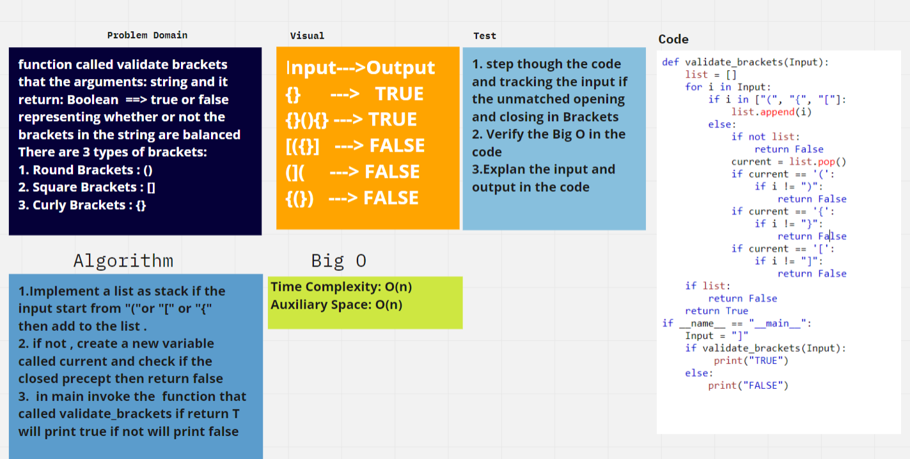

# Challenge Summary
<!-- Description of the challenge -->
## function called validate brackets  and the arguments: string , Return: boolean
## representing whether or not the brackets in the string are balanced
### There are 3 types of brackets:

### 1. Round Brackets : ()
### 2. Square Brackets : []
### 3. Curly Brackets : {}

## Whiteboard Process
<!-- Embedded whiteboard image -->

## Approach & Efficiency
<!-- What approach did you take? Why? What is the Big O space/time for this approach? -->
### I read the Code Challenge and I am working to solve the code in python

## Solution
<!-- Show how to run your code, and examples of it in action -->
### The result will return False after insert the input have an error like this input input_data="({}]"
