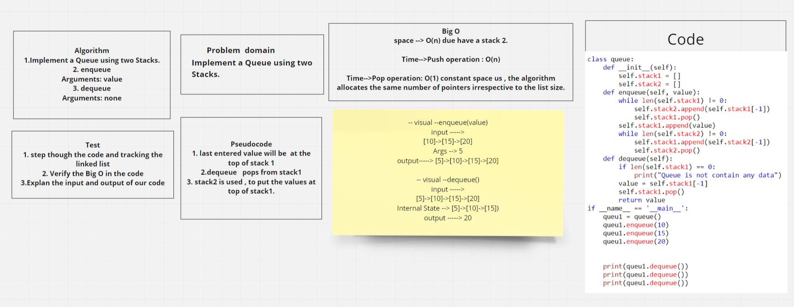
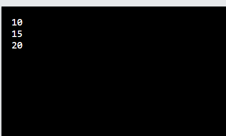

# Challenge Summary
<!-- Description of the challenge -->
Implement a Queue using two Stacks.
## Whiteboard Process
<!-- Embedded whiteboard image -->

## Approach & Efficiency
<!-- What approach did you take? Why? What is the Big O space/time for this approach? -->
### I take approach in about understand how the binary search work and how to return the index that search .

### I take 4 hrs to done all code .
## Solution
<!-- Show how to run your code, and examples of it in action -->
### The result after run the code

