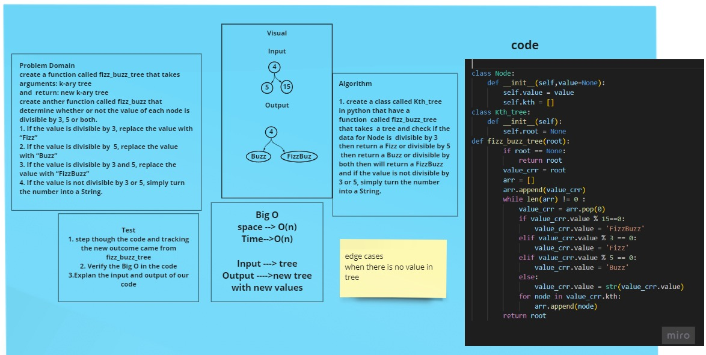

# Challenge Summary
<!-- Description of the challenge -->

## Write a function called fizz buzz tree
1. Arguments: k-ary tree
2. Return: new k-ary tree

### Determine whether or not the value of each node is divisible by 3, 5 or both. Create a new tree with the same structure as the original, but the values modified as follows:

- [x] If the value is divisible by 3, replace the value with “Fizz”
- [x] If the value is divisible by 5, replace the value with “Buzz”
- [x] If the value is divisible by 3 and 5, replace the value with “FizzBuzz”
- [x] If the value is not divisible by 3 or 5, simply turn the number into a String.

## Whiteboard Process
<!-- Embedded whiteboard image -->

## Approach & Efficiency
<!-- What approach did you take? Why? What is the Big O space/time for this approach? -->
###  Big (O)  : Space and Time is O(n)

## Solution
<!-- Show how to run your code, and examples of it in action -->
### The result will be new tree with new values for node.

## the pull requst : https://github.com/shahd1995913/data-structures-and-algorithms/pull/94
