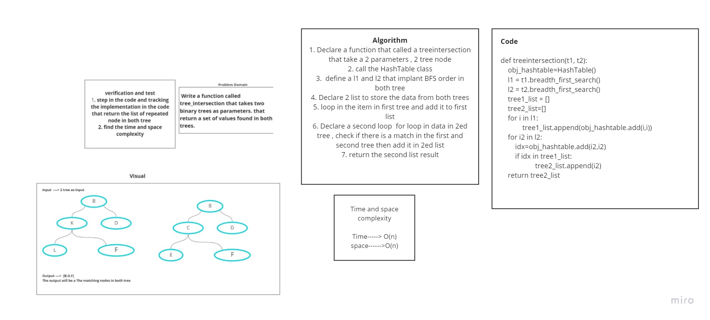

# Challenge Summary
<!-- Description of the challenge -->
# Write a function called treeintersection that takes two binary trees as parameters. Using your Hashmap implementation as a part of your algorithm, return a set of values found in both trees.

## Whiteboard Process
<!-- Embedded whiteboard image -->

## Approach & Efficiency
<!-- What approach did you take? Why? What is the Big O space/time for this approach? -->

# Time Complexity : O(n)
# Space Complexity :O(n)

## Solution
<!-- Show how to run your code, and examples of it in action -->

## I am tracing the final output and the result it works correctly
