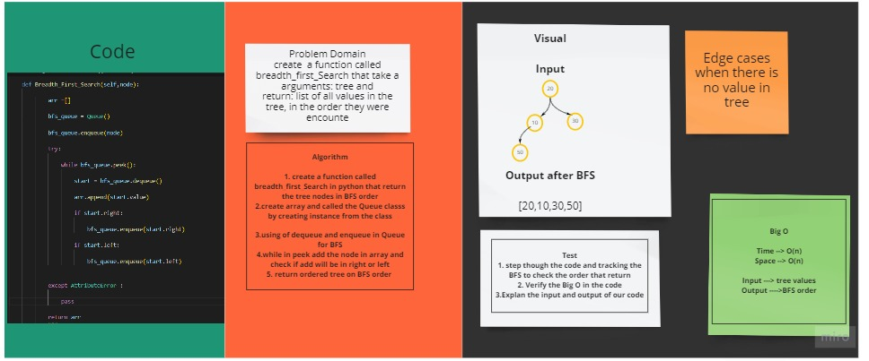

# Challenge Summary
<!-- Description of the challenge -->
## Write a function called breadth first , Arguments: tree , Return: list of all values in the tree, in the order they were encountered

## Whiteboard Process
<!-- Embedded whiteboard image -->

## Approach & Efficiency
<!-- What approach did you take? Why? What is the Big O space/time for this approach? -->
### Big (O) :
### Time  O(n)
### Space O(n)
## Solution
<!-- Show how to run your code, and examples of it in action -->
## the Solution is ordered of tree in BFS
### I take 4 hrs to done all code .

# The pull requst : https://github.com/shahd1995913/data-structures-and-algorithms/pull/82

