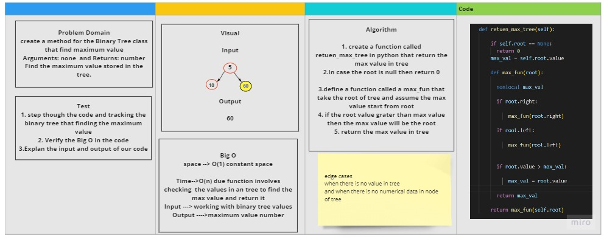

# Trees
<!-- Short summary or background information -->
## Node : Create a Node class that has properties for the value stored in the node, the left child node, and the right child node.
## Binary Tree : Create a Binary Tree class
### Define a method for each of the depth first traversals: pre order ,in order, post order which returns an array of the values, ordered appropriately.
## Binary Search Tree
## Class, with the following additional methods:
### 1. Add
* Arguments: value
* Return: nothing
* Adds a new node with that value in the correct location in the binary search tree.
## 2. Contains
* Argument: value
* Returns: boolean indicating whether or not the value is in the tree at least once.
# ==============================================Code Challenge: Class 16==========================================================
# Find the Maximum Value in a Binary Tree
## Find the maximum value stored in the tree. You can assume that the values stored in the Binary Tree will be numeric.
## Challenge
<!-- Description of the challenge -->
Challenge was when work with  add method in binary tree
the task take 2 hrs to complete
## Approach & Efficiency
<!-- What approach did you take? Why? What is the Big O space/time for this approach? -->
## The time  O(n) and  Space  O(1)  for tree
##  for find the max number in tree

## API

### The method used in binary search tree
1. Add
2. Contains

### The method used in Binary tree
1. pre order
2. post order
3. In order

## Whiteboard Process

## Approach & Efficiency
## space O(1)
## time O(n)
