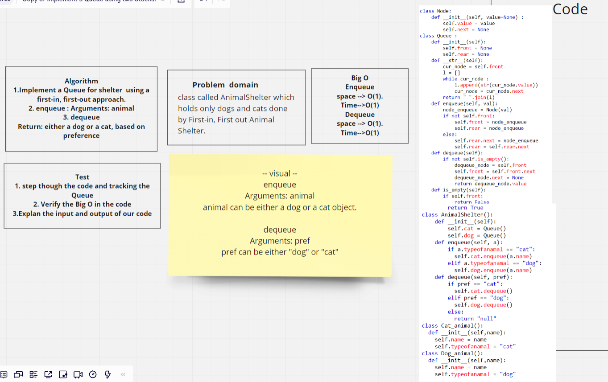
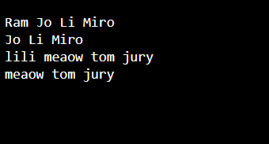

# Challenge Summary
<!-- Description of the challenge -->
## First-in, First out Animal Shelter.
## Create a class called AnimalShelter which holds only dogs and cats.
### The shelter operates using a first-in, first-out approach.

## Whiteboard Process
<!-- Embedded whiteboard image -->

## Approach & Efficiency
<!-- What approach did you take? Why? What is the Big O space/time for this approach? -->
### by employ the Queue and unqueue and dequeue and create a class called a AnimalShelter that have a function for cat and dog
## Solution
<!-- Show how to run your code, and examples of it in action -->
## the result after run the code :

